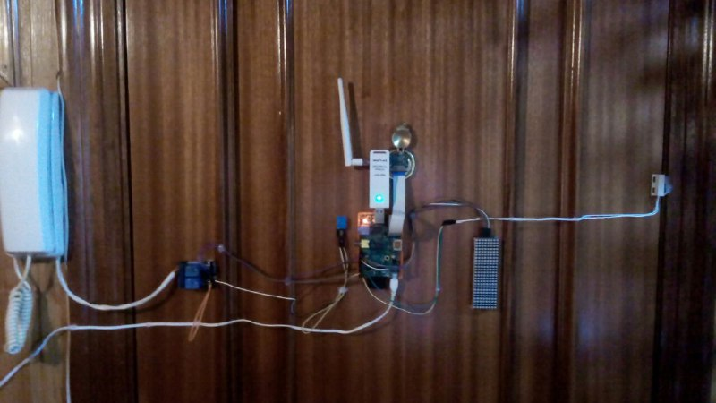

# What a door!
Small domotic Telegram bot. Includes:
* Street door opener through a relay in the entryphone
* Peephole camera
* Temperature and humidity sensor

### Libraries
This bot is intended to be run in a Raspberry Pi. Required libreries are:
* [Adafruit_DHT](https://github.com/adafruit/Adafruit_Python_DHT)
* [telebot](https://github.com/eternnoir/pyTelegramBotAPI)
* PIL

### Running
You'll need a Telegram api key. Please obtain it via @botfather, and then paste it into [line 16 of door.py](door.py)

Then, you'll also need to authorize your Telegram account, setting your user id in [line 28 of the same file](door.py). To find it you can use the /start command. The number after the __Please choose an action.__ is your user id.

Also, connect the following hardware to your Raspberry Pi:
* Relay to BCM Pin 18
* DHT11 to BCM Pin 24
* Magnetic reed switch to BCM Pin 23
* Raspberry Pi Camera

### __What a mess!__
Yes, that's my door.

### Contributing

* The code is licensed under the [GPL V3](LICENSE)
* Feel free to contribute to the code

